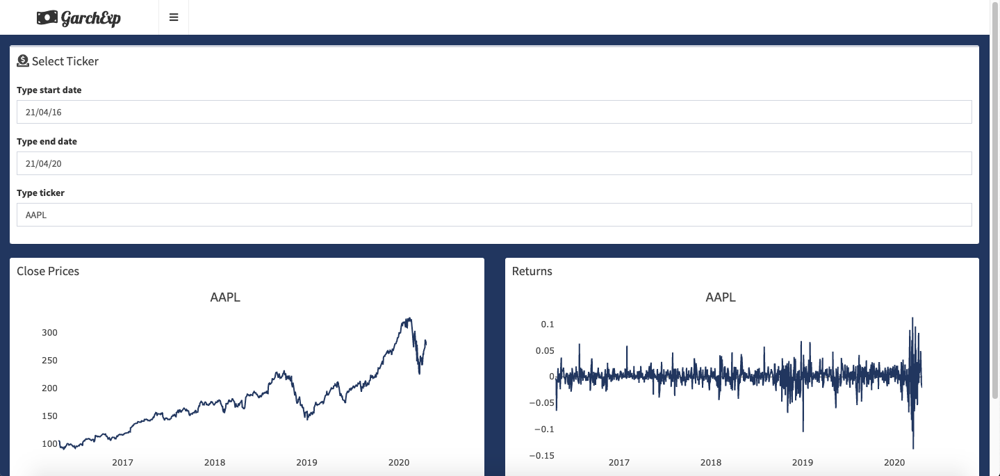

# Garch Explorer
An user-friendly App for modelling time series volatility.
Based on rugarch and rmgarch packaged , this app provide an efficient and simple way to make your own analysis on whatever ticker you want,just typing time period and  ticker's name according to YAHOO Finance.

According to user-friendly setup of the app, when you build  a Univariate Model, garchAuto function suggest you the best order for model, minimizing AIC, it suggest you the best order of ARMA(p,q) + GARCH(1,1).
Please note that for Univariate Models the App take some minutes for building model,especially when you use more sophisticated distribution(ged,sged) and a higher order for ARMA,so please,be patient.

